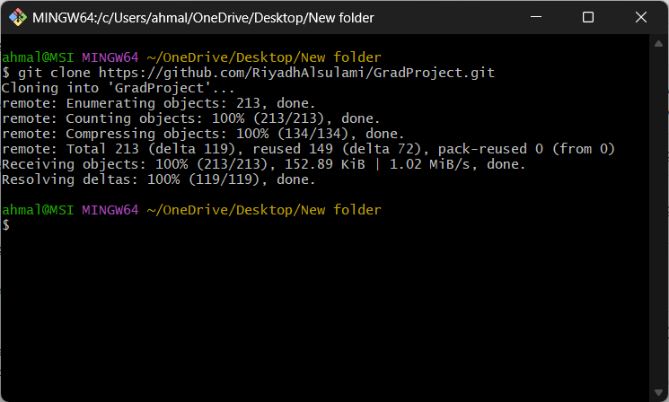
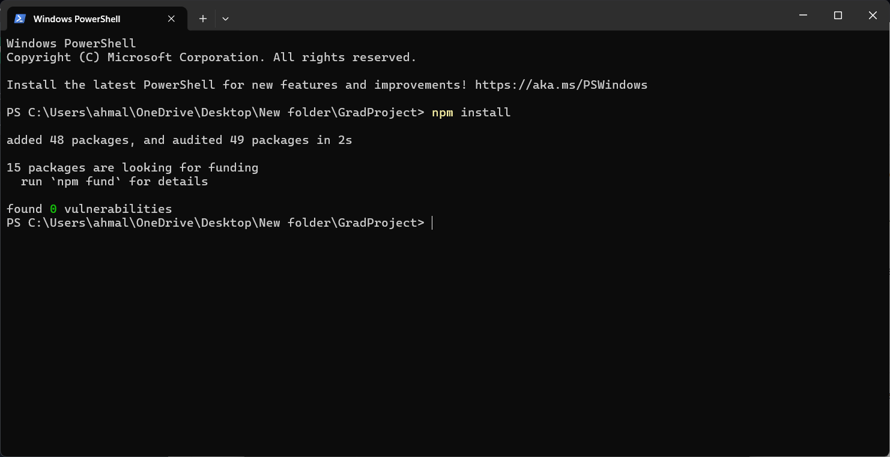
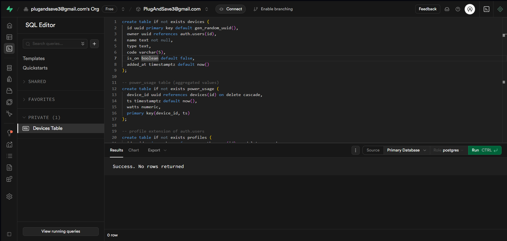
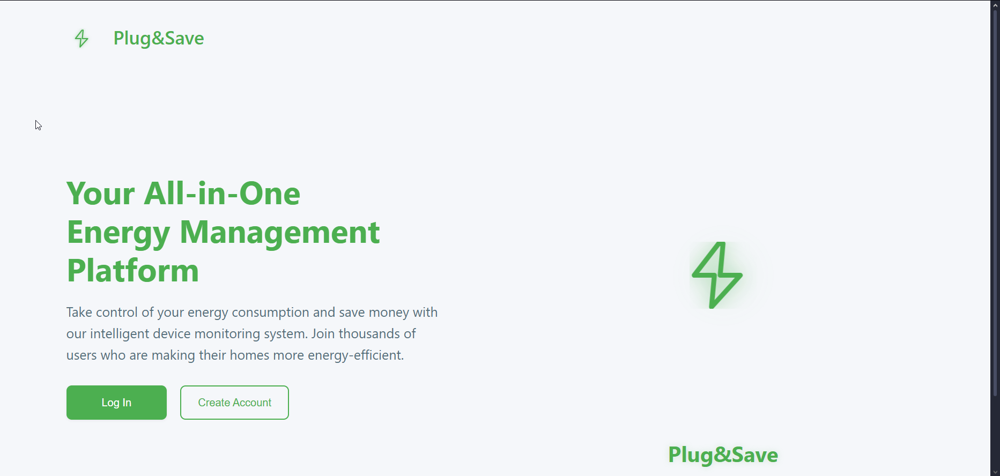
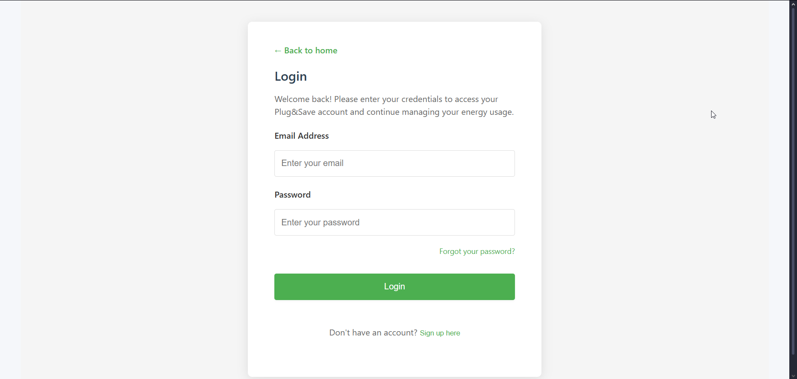
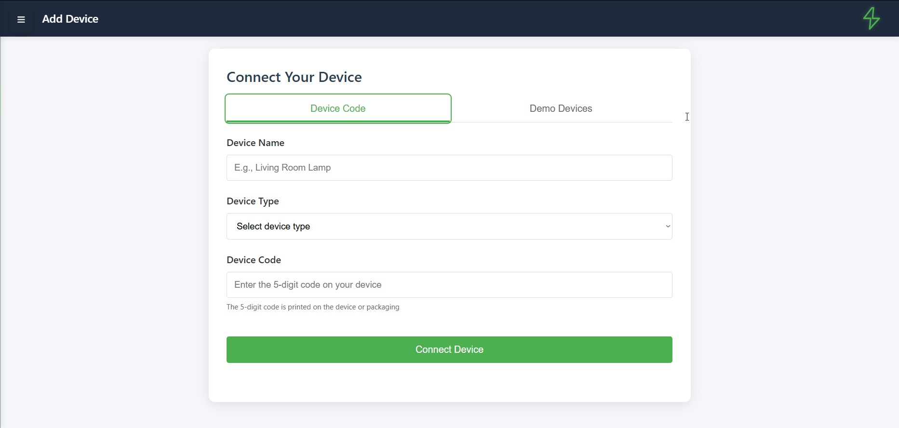
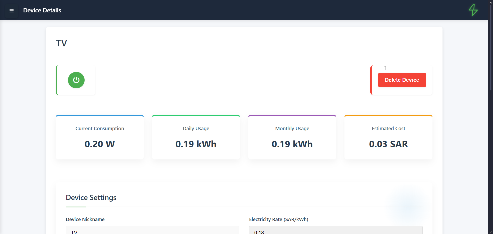
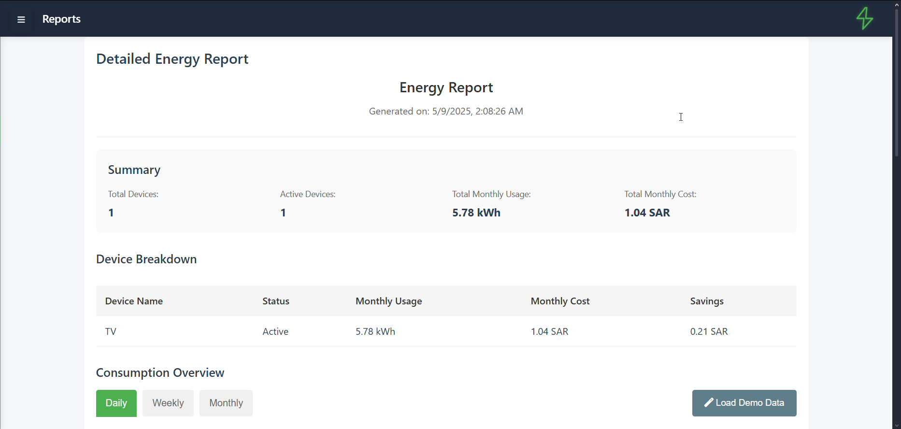
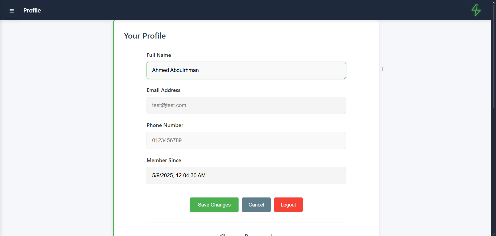
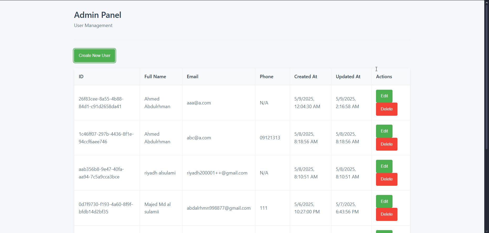

# Appendix B – User Guide for "Plug & Save"

> **Version**: 1.0 &nbsp;&nbsp;|&nbsp;&nbsp; **Last updated**: <!--DATE-->
>
> This appendix gives step-by-step instructions for installing, configuring and using the Plug & Save web application on a fresh computer.  Follow the sections in order and you will have a fully working copy in less than 15 minutes.

---

## 1  Introduction
Plug & Save is a browser-based dashboard for monitoring the power consumption of smart sockets and other IoT devices.  The project is built with **HTML/JS/CSS** on the front-end and uses **Supabase** (PostgreSQL + Auth) as the cloud back-end.  Locally it runs as a static web-site that you can serve with any lightweight HTTP server or a modern bundler such as **Vite**.

---

## 2  System Requirements
| Item | Version | Remark |
|------|---------|--------|
| OS   | Windows 10 / macOS 10.15 / Ubuntu 20.04 or newer | Any OS that can run Node.js |
| Node.js | ≥ 16 | check with `node -v` |
| npm (comes with Node) | ≥ 8 | check with `npm -v` |
| Git  | latest | optional but recommended |
| Browser | Chrome / Edge / Firefox | latest stable release |

---

## 3  Clone the Repository
```bash
# open a terminal where you want the code
$ git clone https://github.com/<your-org>/plug-and-save.git
$ cd plug-and-save
```
{width=90%}

---

## 4  Install Dependencies
```bash
# inside the project directory
$ npm install
```
All client-side libraries listed in `package.json` (e.g. Chart.js, Supabase JS SDK) are now downloaded into the `node_modules/` folder.

{width=90%}

---

## 5  Create & Configure Supabase Project
1. Login to <https://app.supabase.com> and click **+ New Project**.  Choose a name (e.g. *plug-save*) and a strong database password.
2. Once the project is provisioned, open **Project Settings → API** and copy:
   * **Project URL**  → `SUPABASE_URL`
   * **anon public key** → `SUPABASE_ANON_KEY`
3. Still in the dashboard go to **SQL Editor → New Query** and paste the schema below, then click **Run**.

```sql
-- devices table
create table if not exists devices (
  id uuid primary key default gen_random_uuid(),
  owner uuid references auth.users(id),
  name text not null,
  type text,
  code varchar(5),
  is_on boolean default false,
  added_at timestamptz default now()
);

-- power_usage table (aggregated values)
create table if not exists power_usage (
  device_id uuid references devices(id) on delete cascade,
  ts timestamptz default now(),
  watts numeric,
  primary key(device_id, ts)
);

-- profile extension of auth.users
create table if not exists profiles (
  id uuid primary key references auth.users(id) on delete cascade,
  full_name text,
  phone text,
  is_admin boolean default false
);
```
{width=90%}


4. Go to **Auth → Settings → Email Templates** and add your project logo / branding (optional).
5. Finally, in **Database → Policies** enable "Row Level Security" and click **Add Policy** to create *owner-only* policies for each table (see `docs/sql/policies.sql` for ready-made statements).


---

## 6  Environment Variables
Create a plain-text file named **`.env`** in the project root:
```bash
SUPABASE_URL="https://xxxxxxxx.supabase.co"
SUPABASE_ANON_KEY="eyJhbGciOiJ..."
```
> Keep this file **private** – never commit it to GitHub.

The JavaScript in `js/config.js` automatically reads those variables when you start the dev-server.

---

## 7  Run the Application Locally
The application is pure front-end; any static file server will do.  Two popular options:

### 7.1 Live Server (quickest)
```bash
$ npx live-server --port=5173
```
Live-Server opens <http://localhost:5173> in your default browser and reloads on file-changes.

### 7.2 Vite (recommended for production build)
```bash
$ npm run dev      # vite dev-server
$ npm run build    # produce dist/ folder
```
> **Screenshot 4** – Browser showing the landing page after Vite starts

---

## 8  First-time Login & Registration
1. Browse to **http://localhost:5173**.  Click **Create Account**.
2. Fill in Full Name, Email, Password and click **Create Account**.  Check your inbox for the Supabase confirmation e-mail.
3. After verifying e-mail you will be redirected automatically to the **Dashboard**.

{width=90%}

{width=90%}

---

## 9  Feature Walk-through
The following subsections showcase each primary screen.  Use the provided screenshots to locate major UI elements.

### 9.1 Dashboard
{width=90%}
* **Update Usage** – fetches the latest watt-hours from the database.
* Empty-state prompts the user to add the first device.

### 9.2 Add Device

* Enter the 5-digit code printed on your Plug & Save socket **or** pick a demo device for test purposes.

### 9.3 Device Details

* Toggle power, set cost limits and observe real-time consumption.

### 9.4 Energy Reports

* Interactive daily / weekly / monthly charts with historical comparison.

### 9.5 Profile & Account

* Edit personal data, change password, delete account, logout.

---

## 10  Administrator Panel (optional)
If your `profiles.is_admin` flag is **true** you can open `/admin.html`.



* **Create New User** – launches modal, sets email/password/name/phone.
* **Edit** – modify full name or phone.
* **Delete** – permanently remove the account and all related data.

---

## 11  Troubleshooting & FAQ
| Problem | Cause | Solution |
|---------|-------|----------|
| `npm: command not found` | Node not installed / PATH mis-configured | Install Node ≥ 16 and restart terminal |
| Blank page, console shows `Invalid API key` | `.env` values missing or wrong | Re-paste `SUPABASE_URL`, `SUPABASE_ANON_KEY` |
| Password reset email never arrives | Gmail spam filter | Check spam or configure Supabase SMTP sender |
| "403 – RLS violation" when accessing data | Row Level Security policies missing | Re-run the SQL policy script |

---

## 12  Uninstalling / Cleaning Up
1. Simply delete the project folder to remove all local files and node_modules.
2. In Supabase **Project Settings → Delete Project** to terminate cloud resources (irreversible).

---

### 13  Contact & Support
For further assistance email **plugandsave3@gmail.com** or open an issue on the GitHub repo.

---

© 2025 Plug & Save.  All rights reserved. 